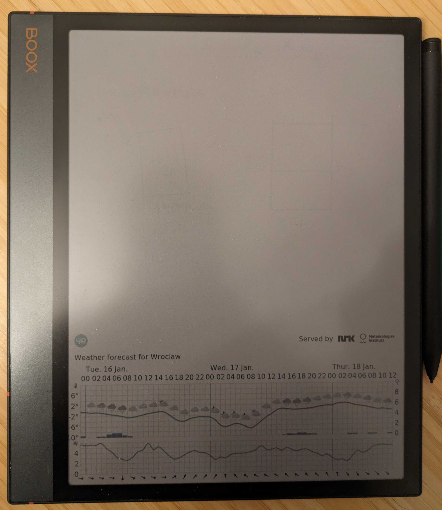

# purpose
create daily wallpaper for e-ink device with current weather
sync it daily

# installation
- `pip install -r requests.txt`
- copy service and timer to /etc/systemd/system/
- `systemctl enable agenda.timer`
- `systemctl start agenda.timer`
- `systemctl list-timers`
- install and [setup](https://docs.syncthing.net/users/autostart.html#linux)  syncthing
- adjust variables: `DEVICE_X_RESOLUTION` and `DEVICE_Y_RESOLUTION`